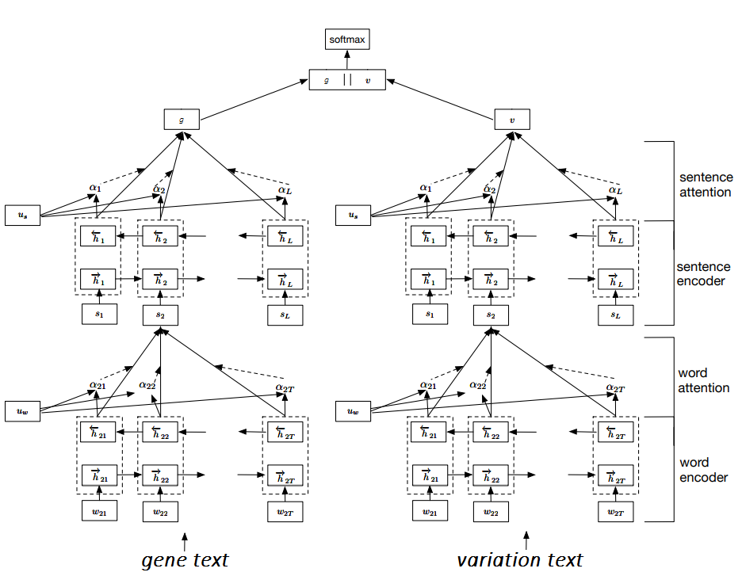

# MSKCC Personalized Medicine Challenge Submission

This is my approach to the [Personalized Medicine: Redefining Cancer Treatment](https://www.kaggle.com/c/msk-redefining-cancer-treatment) challenge on Kaggle. I have made some modifications to the original model that generated the final submission since the end of the competition.

The competition only asks for predictions for 9 classes, but one can also think of them as a combination of 5 condensed classes and 3 likelihood classes:

| Raw Classes (9) | Condensed Classes (5) | Likelihood Classes (3) |
| ------------ | ------------- | ------------- |
| Likely Loss-of-function | Loss-of-function | Likely |
| Likely Gain-of-function | Gain-of-function | Likely |
| Neutral | Neutral | Sure |
| Loss-of-function | Loss-of-function | Sure |
| Likely Neutral | Neutral | Likely |
| Inconclusive | Inconclusive | Inconclusive |
| Gain-of-function | Gain-of-function | Sure |
| Likely Switch-of-function | Switch-of-function | Likely |
| Switch-of-function | Switch-of-function | Sure |

The code here generates 3 models with the same arhitecture, each trained separately (on 80% of the Stage 1 training data) to predict the Raw, Condensed, and Likelihood classes, with the following results on the Stage 1 and Stage 2 test data (possibly unreliable, see [this](https://www.kaggle.com/c/msk-redefining-cancer-treatment/discussion/40676) and [this](https://www.kaggle.com/c/msk-redefining-cancer-treatment/discussion/42129)):

###### Raw Labels Model (9 classes)

| | Validation data (20% of train) | Stage 1 Test data | Stage 2 test data |
| ------------ | ------------ | ------------- | ------------- |
| **Log Loss** | 1.1017 | 1.1013 | 3.609 |
| **Accuracy** | - | 61.1% | 13.6% |

###### Condensed Labels Model (5 classes)

| | Validation data (20% of train) | Stage 1 Test data | Stage 2 test data |
| ------------ | ------------ | ------------- | ------------- |
| **Log Loss** | 0.5538 | 0.6201 | 2.9057 |
| **Accuracy** | - | 76.1% | 20% |

###### Likelihood Labels Model (3 classes)

| | Validation data (20% of train) | Stage 1 Test data | Stage 2 test data |
| ------------ | ------------ | ------------- | ------------- |
| **Log Loss** | 0.6431 | 0.6999 | 1.0935 |
| **Accuracy** | - | 66.9% | 34.4% |

The scores are not especially impressive (among other reasons, the model is trained on only 80% of the original training data, and hyperparameters are not tuned), but the approach is versatile and intrepretable. The solution also ONLY uses the provided text data in the training set, so there are a lot of potential improvements to be made by using external data. Please see [Usage and Approach](#usage-and-approach) for more details on the approach and visualizations.

## Usage and Approach

### Include Data Files
Populate the [`data`](data/) directory with the competition data files from both stages:
```
stage_2_private_solution.csv
stage1_solution_filtered.csv
stage2_sample_submission.csv
stage2_test_text.csv
stage2_test_variants.csv
test_text
test_variants
training_text
training_variants
```
This solution uses custom trained word2vec vectors. To produce them, populate the [`MEDLINE`](wordEmbeddings/PubmedOA_MEDLINE_XML/MEDLINE) directory with [MEDLINE](https://www.nlm.nih.gov/databases/download/pubmed_medline.html) articles. See [`README`](wordEmbeddings/PubmedOA_MEDLINE_XML/README) for more detailed instructions (for this particular solution, MEDLINE articles available on 8/28/17 were downloaded and used). Note that the word vectors used in this solution are trained on only MEDLINE abstracts; populate the [`PubmedOA`](wordEmbeddings/PubmedOA_MEDLINE_XML/PubmedOA) directory (also see the [`README`](wordEmbeddings/PubmedOA_MEDLINE_XML/README)) and uncomment some lines in [`evidence_filter.py`](wordEmbeddings/evidence_filter.py) if you also want to include articles from the [PubMed Open-Access (OA) subset](http://www.ncbi.nlm.nih.gov/pmc/tools/ftp/).

### Train word2vec Model
From the [`wordEmbeddings`](wordEmbeddings/) directory, run [`evidence_filter.py`](wordEmbeddings/evidence_filter.py)
```python
python evidence_filter.py
```
What that does is:
1. Query OncoKB for a list of PMIDs cited (NOT THE LABELS).
2. From the list of PMIDs, figure out which journals they are from, e.g. Nature Cell Biology, Cell Cycle, etc. Gathering this list of journal names is the only extent at which OncoKB is used in this solution.
3. Go through all the MEDLINE articles in [`MEDLINE`](wordEmbeddings/PubmedOA_MEDLINE_XML/MEDLINE), and pick the ones that are published in those journals. The idea is that only articles that are most related to cancer are retained.
4. Extract abstract texts from the filtered MEDLINE articles.
5. Preprocess the text:
   * Remove any titlecased or all uppercase lines.
   * Normalize any non-ascii unicode characters to ascii characters.
   * Tokenize into sentences using NLTK's PunktSentenceTokenizer.
   * Tokenize each sentence into words using NLTK's TreebankWordTokenizer.
   * Lowercase every word, as an attempt to reduce vocabulary (e.g. 'protein', 'Protein', and 'PROTEIN' will all be lumped as 'protein') since the amount of corpus data is relatively small.
   * Lemmatize the words using [BioLemmatizer 1.2](http://biolemmatizer.sourceforge.net/), also as an attempt to reduce vocabulary (e.g. 'protein' and 'proteins' are both lumped as 'protein').
6. Train a word2vec model on the resulting text (551338 unique tokens) using [gensim](https://radimrehurek.com/gensim/models/word2vec.html) and hyperparameters from the paper, [How to Train Good Word Embeddings for Biomedical NLP (Chiu et al.)](https://aclweb.org/anthology/W/W16/W16-2922.pdf). Due to the relatively small training set, the model is trained with 60 iterations.

**Output**: A saved gensim word2vec model `medline_SHUFFLED_biomedical_embeddings_200_lit_params_win2_60iters` in the [`wordEmbeddings`](wordEmbeddings/) directory.

For sanity check, a visualization of the word vectors was produced, by running t-SNE on the top 1000 most common words, and plotting the top 250 most common words (see [`tsne.py`](wordEmbeddings/tsne.py)):


We see that the vectors look decent, e.g. the vectors for {'breast', 'cancer', 'tumor', 'carcinoma'} are close together, vectors for {'domain', 'site', 'sequence', 'region'} are close together, etc.

### Train Models
From the root directory, run [`main.py`](wordEmbeddings/main.py) with `train` flag to train and save the weights of the models:
```python
python main.py train
```
What that does is:

#### 1. Load Data
Load the Stage 1 Training data, Stage 1 Test data, and Stage 2 Test data; the machine generated instances of the test data are filtered out.

#### 2. Preprocess Text
For each text data instance:
   1. 

#### 3. Build Models


#### 4. Train Models
3. Build and train models. The 3 models (Raw Labels, Condensed Labels, Likelihood Labels) all have essentially the same architecture, the only difference being the last softmax layer outputs either 9, 5, or 3 classes:
   * The model artchitecture is derived from the paper, [Hierarchical Attention Networks for Document Classification (Yang et al.)](https://www.cs.cmu.edu/~diyiy/docs/naacl16.pdf).
   * Figure 2 of that paper shows a Hierarchical Attention Network, featuring a word sequence encoder, a word-level attention layer, a sentence encoder, and a sentence-level attention layer. Refer to the paper for more details, but the general idea is that given a document with sentences and words, the sentences and words are each encoded using bidirection GRUs, and two levels of attention mechanisms are applied at the word and sentence-level to enable the network to attend to important content when constructing the document representation. The resulting document representation is then fed to a softmax layer for classification. A property of this network architecture is that the learned word and sentence level attention weights can be used to visualize and interpret the model.
   * In our case, sentences relevant to the gene in question, and sentences relevant to the variation in question are extracted separately. Two Hierarchical Attention Networks are constructed, each taking the gene text and variation text as inputs separately. The resulting gene document vector `g` and variation document vector `v` are concatenated, and fed to a softmax layer for classification (either 9, 5, or 3 classes as output):



   * The above network architecture (generated by altering Figure 2 from the original paper) is used to build the Raw Labels Model, the Condensed Labels Model, and the Likelihood Labels Model.
   * The gene and variation text are first truncated as follows: keep only the first 200 sentences, and keep only the first 100 words of each sentence; any sentences and words less than desired are padded with zeros. The motivation for setting a maximum document size of 200 and maximum sentence length of 100 is based off of the distributions of document and sentence lengths:
   
Train Gene Text:

 
   
   
Train Variation Text:

 
   
   * The resulting texts are embedded using our word2vec model (see [Train word2vec Model](#train-word2vec-model)); each word embedding dimension is 200.
   * The GRU dimension is set to be 50 in the Raw Labels Model, and 25 in the Condensed and Likelihood Models. These values are chosen somewhat arbitrarily--they're values at which my laptop can handle training in a reasonable time.
   * For training, a mini-batch size of 32 is used, and the Raw Labels Model, Condensed Labels Mode, and Likelihood Models are trained for 5, 6, and 6 epochs respectively (epochs that reached lowest score on the 20% validation set in my experimentation).
 4. The weights of the resulting models are saved in `"raw_MEDLINE60iterw2v_GRU50" + ".{epoch:02d}-{loss:.4f}-{val_loss:.4f}-{test_loss:.4f}-{test2_loss:.4f}.hdf5"`, `"condensed_class_MEDLINE60_GRU25" + ".{epoch:02d}-{loss:.4f}-{val_loss:.4f}-{test_loss:.4f}-{test2_loss:.4f}.hdf5"`, and `"likelihood_MEDLINE60_GRU25" + ".{epoch:02d}-{loss:.4f}-{val_loss:.4f}-{test_loss:.4f}-{test2_loss:.4f}.hdf5"`. `test_loss` and `test2_loss` are the Stage 1 and Stage 2 test data log loss values respectively, so if I set the numpy and random seeds properly in my code, you should yield the following files: `raw_MEDLINE60iterw2v_GRU50.04-0.7716-1.1017-1.1013-3.6090.hdf5`, `condensed_class_MEDLINE60_GRU25.06-0.3916-0.5538-0.6201-2.9057.hdf5`, and `likelihood_MEDLINE60_GRU25.05-0.5529-0.6431-0.6999-1.0935.hdf5`. If your values are slightly different, remember to change the weights file names accordingly in [`main.py`](wordEmbeddings/main.py) before you build the visualizations (see [Visualize and Interpret Models](#visualize-and-interpret-models)).

### Visualize and Interpret Models
A neat thing about our model architecture is that attention mechanisms are applied at the sentence and word-level, and so sentence importance and word importance can be visualized. Specifically, we can do a forward pass on our networks with the test data instances, and extract the sentence weights p<sub>s</sub> and word weights p<sub>w<sub>.

The visualizations of the models' sentence and word weights assignment to the Stage 1 and Stage 2 test data are available here:
https://wlouie1.github.io/MSKCCPersonalizedMedicineChallenge/visualization

Note that the page may take a couple of minutes to fully load, so **be patient**. Once it does, it should look something like this:


#### Navigation Bar
On the navigation bar on the top, there is a drop down at the top right that allows you to select the `ID` of the test data instance. The corresponding Gene/Variation information is on the top left. You can select prediction results for `Stage 1` or `Stage 2` test data, and the models to generate results--`Raw Model` or `Condensed + Likelihood Models`. There are also two modes you can toggle: `Filtered and Sorted` (default) and `Full Text View`, which shows just the sentences the models considered for the prediction, or the entirety of the provided text respectively. 

#### Main Body
Shown in the main body of the page are the models results. In the `Filtered and Sorted` mode of the page, the sentences are ranked highest attention weight to lowest attention weight, with the opacity of the red color corresponding to the weight values. In each sentence, words are highlighted in blue, and the opacity of the blue corresponds to their attention weight values--the darker the blue highlight, the more "significant" the word is to the model. Due to the hierarchical structure, the word weights are normalized by the sentence weight to make sure that only important words in important sentences are emphasized. Specifically, the red opacity and blue opacity for each sentence and word corresponds to (log<sub>2</sub>(1 + p<sub>s</sub>))<sup>&#188;</sup> and (log<sub>2</sub>(1 + p<sub>s</sub>))<sup>&#188;</sup>(log<sub>2</sub>(1 + p<sub>w</sub>))<sup>&#188;</sup> respectively, to ensure semi-important sentences, and semi-important words in unimportant sentences, are not completely invisible. The `Full Text View` shows the original given text, not just the text subset used to train the models. 

In the screenshot example above, `ID` 651 of the Stage 1 Test data is selected (DIS3/R780K), and the models correctly predict it to be Loss-of-function. The Raw Labels model and the Condensed Labels model both attribute phrases such as `mutations markedly reduced hdis3 exoribonucleolytic activity` and `catalytic rnb mutant` as important in classifying the gene variation as Loss-of-function. Not all of the test data instances are assigned important sentences and words that make sense, but you can see that many of them seem to be in the general right direction if you click around and explore other result instances in the test data.

#### Building the Visualizations Locally
To build the visualizations locally, run [`main.py`](wordEmbeddings/main.py) with `visualize` flag:

```python
python main.py visualize
```
This will generate JSON files containing sentence and word weights information in the [`results`](visualization/results/) directory. Host the outer [`visualization`](visualization/) directory to view the results in a browser. For example, to host and view in a browser locally using python, run the following from the [`visualization`](visualization/) directory:
```python
python -m SimpleHTTPServer
```
And then open up http://localhost:8000/ in a browser. Again, the page may take a couple of minutes to fully load.

## Dependencies
Python 2.7.13
* requests==2.12.4
* pandas==0.19.2
* matplotlib==2.0.0 (optional, for plotting)
* ggplot==0.11.5 (optional, for plotting)
* Keras==2.0.6 (Theano 0.9.0 backend used)
* nltk==3.2.2
* gensim==2.3.0
* numpy==1.13.1
* scikit_learn==0.19.1

[BioLemmatizer 1.2](http://biolemmatizer.sourceforge.net/) (in [`utils`](utils/) directory)

## Credits

[attention.py](attention.py) and [entities.dat](entities.dat) are borrowed from [cbaziotis's gist](https://gist.github.com/cbaziotis/7ef97ccf71cbc14366835198c09809d2) and [spyysalo's biomedical unicode2ascii project](https://github.com/spyysalo/unicode2ascii/blob/master/entities.dat) respectively.
